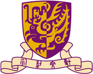
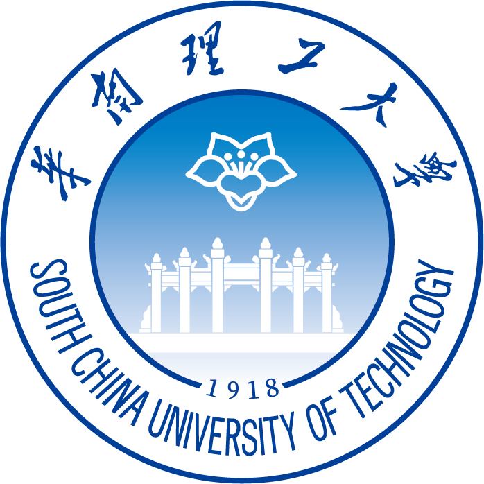

I am a Ph.D student at [The Chinese University of Hong Kong](https://www.cuhk.edu.hk/english/index.html#), fortunately advised by [Prof. Xunying Liu](https://www.se.cuhk.edu.hk/people/academic-staff/prof-liu-xunying/). Before that, I received my B.E degree from [School of Software Engineering](https://www2.scut.edu.cn/sse/), [South China University of Technology](https://www.scut.edu.cn/), with the highest honor **Top Ten Excellent Students Models of SCUT**.
My research interests include speech, audio and language processing, including ASR, et al.

# 📕 Publications
+ **Hi-Patch: Hierarchical Patch GNN for Irregular Multivariate Time Series**     
  Yicheng Luo, **Bowen Zhang**, Zhen Liu, Qianli Ma         
  *ICML 2025*
+ **Toward Physics-guided Time Series Embedding**   
Jiaxi Hu, **Bowen Zhang**, Qingsong Wen, Fugee Tsung, Yuxuan Liang         
*ICASSP 2026*

# 🏠 Education

* **The Chinese University of Hong Kong**            
Ph.D. Student, 2025.8 ~ Present  
Advisor: [Prof. Xunying Liu](https://www.se.cuhk.edu.hk/people/academic-staff/prof-liu-xunying/)  

* **South China University of Technology**            
Undergraduate Student, 2021.9 ~ 2025.6  
GPA: 3.89/4.0, Rank: 2/49, with the highest honor at SCUT

# 🚶 Experience

* **The Hong Kong University of Science and Technology (Guangzhou)**            
Research Intern @ [CityMind Lab](https://citymind.top/), 2024.6 ~ 2024.9  
Research Topic: Time-series Modeling & Spatio-temporal Data Mining      
Advisor: [Prof. Yuxuan Liang](https://yuxuanliang.com/)  

* **South China University of Technology**            
Research Intern @ [Machine Learning and Data Mining Lab](https://www2.scut.edu.cn/qianlima/), 2023.10~2024.6   
Research Topic: Time-series & Graph Neural Network & Mixture of Experts
Advisor: [Prof. Qianli Ma](https://www2.scut.edu.cn/qianlima/English/list.htm)       

* **South China University of Technology**            
Project/Research Intern @ [Key Laboratory of Big Data and Intelligent Robot](https://www2.scut.edu.cn/klbdir/), 2023.3~2024.6   
Main Project: WiseSight: AIGC-based Smart Glasses for Elderly Life Assistance   
Advisor: [Prof. Yi Cai](https://scholar.google.com.hk/citations?user=ej3Nb5wAAAAJ&hl=zh-CN)  

* **South China University of Technology**            
Project Intern @ [Group of Large Software Development and Application](https://www2.scut.edu.cn/sse/2018/0614/c16788a270676/page.htm), 2022.12~2023.12   
Project Topic: A question&answer system for cpp knowledge  
Advisor: [Prof. Fei Liu](https://scholar.google.com/citations?hl=en&user=gC-YMYgAAAAJ&view_op=list_works)  

# 🎖 Honors & Awards
* Hong Kong Postgraduate Scholarship, 2025-2029
* National Scholarship, 2022 (Top 0.2% nation-wide)
* Top Ten Excellent Students Models of South China University of Technology, 2023 (15k RMB, Top 10/27557 at SCUT, the highest honor for undergraduates of SCUT)
* Top Ten Excellent Communist Party Members Nomination Award of South China University of Technology, 2024 (Top 16/51324 at SCUT)
* Shenzhen Haopeng Technology Diligence Scholarship, 2024 (10k RMB, Rank 1/412)
* First Prize Scholarship of South China University of Technology, 2023 (Top 2% at SCUT)
* First-class of Hongping Changqing Technology Innovation Scholarship of SCUT, 2024
* "Encounter Xiaomian" Innovation Scholarship of SCUT (twice), 2024
* Top Ten Excellent Classes Nomination Award of South China University of Technology (as monitor), 2023 (Top 12 of all undergraduate classes at SCUT)
* Mathematical Contest In Modeling (MCM): Finalist, 2023 (Top 0.17% world-wide)
* The Chinese Mathematics Competitions (Guangdong): First Prize, 2022 & 2023 (twice, Top 7.8% provincial)
* National College Student Algorithm Design and Programming Challenge: Gold Prize, 2023 (Top 5% nation-wide)
* Cross-Strait and Hong Kong-Macao College Student Computer Innovation Competition: First Prize & Best Innovation Prize (Guangdong, Rank 2/333) & National Third Prize, 2024
* MathorCup College Mathematical Modeling Challenge: Second Prize, 2023 

# 💻 Service
* Monitor of class, Software Engineering(Excellent Engineer Class), SCUT, 2022-2025
* Teaching Assistance: SEEM3440 Operations Research II(2025 Fall), SEEM4540 Open Systems for E-Commerce(2026 Spring)
