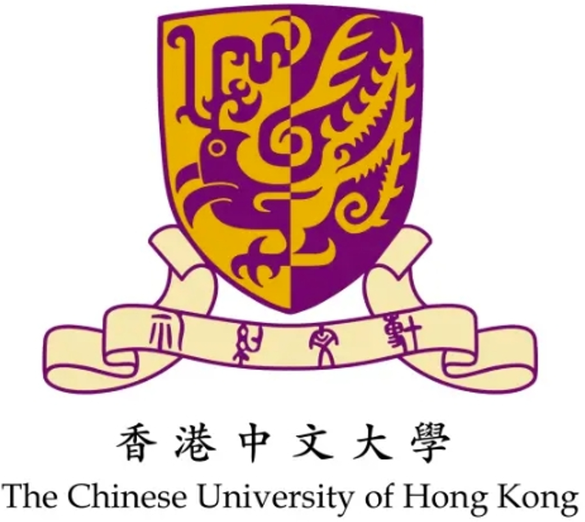

I am a final-year undergraduate student majoring in **Software Engineering** at the [School of Software Engineering](https://www2.scut.edu.cn/sse/), [South China University of Technology](https://www.scut.edu.cn/). <!---Plus, I am an incoming Ph.D. student (2025Fall) at [The Chinese University of Hong Kong](https://www.cuhk.edu.hk/chinese/index.html). -->Now I am a research intern in [CityMind Lab](https://citymind.top/) at [HKUST(GZ)](https://www.hkust-gz.edu.cn/), advised by Prof. [Yuxuan Liang](https://yuxuanliang.com/). Previously, I joined [Machine Learning and Data Mining Lab](https://www2.scut.edu.cn/qianlima/) at [SCUT](https://www.scut.edu.cn/), advised by Prof. [Qianli Ma](https://www2.scut.edu.cn/qianlima/English/list.htm). And I joined [Key Laboratory of Big Data and Intelligent Robot](https://www2.scut.edu.cn/sse/2018/0615/c16788a270751/page.htm) at [SCUT](https://www.scut.edu.cn/), advised by Prof. [Yi Cai](https://scholar.google.com.hk/citations?user=ej3Nb5wAAAAJ&hl=zh-CN). My research interests include **Time Series Modeling**, **Language and Speech Processing**.
# News

- [Sep. 2024] Awarded **[First-class of Hongping Changqing Technology Innovation Scholarship](https://www2.scut.edu.cn/_upload/article/files/95/21/192f9fa84a9dbbabe5641a8c1304/4df3c38b-e435-4d9a-b480-af5893d93b2c.pdf)** of SCUT!(￥3000)
- [Sep. 2024] Two papers about *Time-series Modeling* are submitted to **ICLR2025**!
<!--- [Aug. 2024] Happy to receive a Ph.D. offer from **[CUHK](https://www.cuhk.edu.hk/chinese/index.html)**!-->
- [Apr. 2024] Awarded **[Top Ten Excellent Communist Party Members Nomination Award](https://mp.weixin.qq.com/s/AXQzvTPrwo7ziBO1-_E-jw)** of South China University of Technology!
- [Dec. 2023] Awarded **[Top Ten Excellent Students Models](https://news.scut.edu.cn/2023/1129/c160a47957/page.htm)** of South China University of Technology! (The **best honor** for undergraduates of SCUT, Top 0.05%)
- [Sep. 2023] Awarded **First-class Prize Scholarship** of SCUT!
- [Dec. 2022] Awarded **[National Scholarship](http://www.moe.gov.cn/jyb_xxgk/s5743/s5744/A05/202212/t20221227_1036671.html)**!

# Education
<!--

* **The Chinese University of Hong Kong**, Hong Kong SAR, China           
  Incoming Ph.D. student, 2025~Present       
-->

* **South China University of Technology**, Guangzhou, China           
  B.E. in Software Engineering(Excellent Engineer Class), 2021~2025 (expected)         
  GPA: 3.87/4.0 (90.67/100, Rank 4/49)     

# Experience

* **The Hong Kong University of Science and Technology (Guangzhou)**            
  Research Intern @ [CityMind Lab](https://citymind.top/), 2024.6 ~ Present  
  Research Topic: Time-series Modeling & Spatio-temporal Data Mining      
  Advisor: [Yuxuan Liang](https://yuxuanliang.com/)  

* **South China University of Technology**            
  Research Intern @ [Machine Learning and Data Mining Lab](https://www2.scut.edu.cn/qianlima/), 2023.10~2024.9   
  Research Topic: Time-series & Graph Neural Network & Mixture of Experts
  Advisor: [Qianli Ma](https://www2.scut.edu.cn/qianlima/English/list.htm)       

* **South China University of Technology**            
  Research/Project Intern @ [Key Laboratory of Big Data and Intelligent Robot](https://www2.scut.edu.cn/sse/2018/0615/c16788a270751/page.htm), 2023.3~2024.6   
  Research Topic: Natural Language Processing & Computer Vision & Speech Processing   
  Advisor: [Yi Cai](https://scholar.google.com.hk/citations?user=ej3Nb5wAAAAJ&hl=zh-CN)  

# Honors & Awards
* National Scholarship, 2022 (Top 0.2% nation-wide)
* Top Ten Excellent Students Models of South China University of Technology, 2023 (Top 0.05% at SCUT, only ten of all undergraduates at SCUT)
* Top Ten Excellent Communist Party Members Nomination Award of South China University of Technology, 2024 (Top 0.02% of all students at SCUT)
* First-class Prize Scholarship of South China University of Technology, 2023 (Top 4%)
* First-class of Hongping Changqing Technology Innovation Scholarship, 2024
* Top Ten Excellent Classes Nomination Award of South China University of Technology (as monitor), 2023 (only ten of all undergraduate classes at SCUT)
* Mathematical Contest In Modeling (MCM): Finalist, 2023 (Top 0.17% world-wide)
* The Chinese Mathematics Competitions (Guangdong): First Prize, 2022 & 2023 (twice, Top 7.8% provincial)
* National College Student Algorithm Design and Programming Challenge: Gold Prize, 2023 (Top 5% nation-wide)
* College Student Computer Innovation Competition (Guangdong): First Prize & Best Innovation Prize, 2024 (Top 0.6%, Rank 2/333)
* MathorCup College Mathematical Modeling Challenge: Second Prize, 2023 (Top 18% nation-wide)
